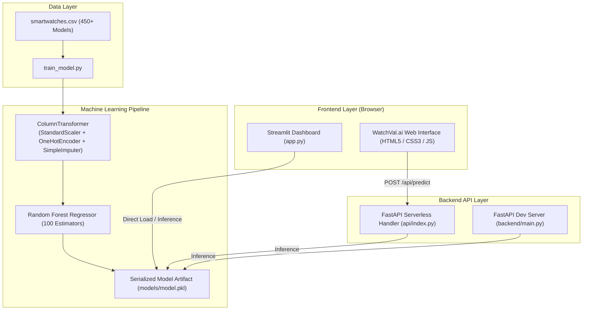

# ⌚ Smartwatch Price Predictor (WatchVal.ai)

[](https://smartwatch-price-predictor-dal93r7z9-med-ai3.vercel.app/)
[](https://www.python.org/)
[](https://fastapi.tiangolo.com/)
[](https://scikit-learn.org/)
[](https://streamlit.io/)
[](https://opensource.org/licenses/MIT)

An end-to-end Machine Learning web platform designed to evaluate and predict the real market value, resale price, and value retention rate of smartwatches based on brand authority, original retail price (MRP), customer satisfaction ratings, and review volume.

---

## 🌐 Live Application

- **Live Web App**: [https://smartwatch-price-predictor-dal93r7z9-med-ai3.vercel.app/](https://smartwatch-price-predictor-dal93r7z9-med-ai3.vercel.app/)
- **GitHub Repository**: [https://github.com/akshay200613/smartwatch-price-predictor](https://github.com/akshay200613/smartwatch-price-predictor)

---

## 📑 Table of Contents

- [Key Features](#-key-features)
- [System Architecture](#-system-architecture)
- [Machine Learning Pipeline](#-machine-learning-pipeline)
- [Tech Stack](#-tech-stack)
- [Directory Structure](#-directory-structure)
- [API Reference](#-api-reference)
- [Installation & Local Setup](#-installation--local-setup)
- [Usage Guide](#-usage-guide)
- [Model Retraining](#-model-retraining)
- [Deployment](#-deployment)
- [Contributing & License](#-contributing--license)

---

## ✨ Key Features

### 🤖 Machine Learning Valuation Engine
- **Random Forest Regression Ensemble**: Captures non-linear brand price decay, customer sentiment impact, and market volume weighting.
- **Automated Preprocessing**: Handles missing data imputation, standard feature scaling, and categorical one-hot encoding seamlessly via Scikit-Learn `Pipeline` and `ColumnTransformer`.
- **Value Retention & Fair-Value Range**: Calculates percentage of MRP retained, estimated market demand tier, and fair valuation brackets (Low / High).

### 🎨 Modern Dark Glassmorphic Web App (`WatchVal.ai`)
- **Interactive Particle Background**: Dynamic Canvas physics simulation with mouse repulsion and connecting constellation webs.
- **Synchronized Sliders & Quick Presets**: Dual input synchronization for instant price and rating tuning.
- **Live Digital Watch HUD**: Real-time interactive watch simulation showing simulated clock, brand face, and instantaneous price estimation.
- **Client Fallback Resilience**: Built-in heuristic fallback engine ensuring zero downtime even during offline backend states.
- **Copy & Share Cards**: Instant one-click clipboard copying and native web sharing for appraisal reports.

### 🚀 Dual Backend & Exploration Interfaces
- **FastAPI Serverless Backend (`api/index.py`)**: Low-latency REST API optimized for serverless execution on Vercel.
- **Streamlit Interactive App (`app.py`)**: Data-science friendly dashboard for rapid testing and experimentation.

---

## 🏗️ System Architecture



---

## 📊 Machine Learning Pipeline

### 1. Dataset Overview
- **Source**: `data/smartwatches.csv` containing multi-brand wearable specifications and e-commerce transaction data.
- **Key Columns**:
  - `Brand`: Manufacturer/Brand name (e.g., Apple, Samsung, Garmin, boAt, Noise, Fire-Boltt).
  - `Original Price`: Manufacturer Suggested Retail Price (MRP) in INR (₹).
  - `Rating`: Average customer star rating (1.0 – 5.0).
  - `Number OF Ratings`: Total review and rating count representing social proof/volume.
  - `Current Price`: Target variable ($y$) — actual discounted/market selling price in INR (₹).

### 2. Feature Engineering & Preprocessing
```python
preprocessor = ColumnTransformer(
    transformers=[
        ('num', Pipeline([
            ('imputer', SimpleImputer(strategy='median')),
            ('scaler', StandardScaler())
        ]), ['Original Price', 'Rating', 'Number OF Ratings']),
        ('cat', Pipeline([
            ('imputer', SimpleImputer(strategy='constant', fill_value='missing')),
            ('onehot', OneHotEncoder(handle_unknown='ignore'))
        ]), ['Brand'])
    ]
)
```

### 3. Model Training
- **Regressor**: `RandomForestRegressor(n_estimators=100, random_state=42)`
- **Packaging**: Combined into a single end-to-end Scikit-Learn `Pipeline` saved as `models/model.pkl`.

---

## 🛠️ Tech Stack

| Domain | Technologies Used |
|---|---|
| **Machine Learning** | Python 3.9+, Scikit-Learn, Pandas, NumPy, Joblib |
| **API Backend** | FastAPI, Uvicorn, Pydantic |
| **Frontend** | HTML5, Vanilla CSS3 (Custom Design System), JavaScript (ES6+ Fetch API), FontAwesome |
| **Data Dashboard** | Streamlit |
| **Deployment & Hosting** | Vercel (Python Serverless Runtime), Git, GitHub |
| **Research & Analysis** | Jupyter Notebook (`01_Smartwatch_Pricing_Regression.ipynb`), PDF & PPTX Reports |

---

## 📁 Directory Structure

```
smartwatch_project/
│
├── api/
│   └── index.py               # Vercel FastAPI serverless entry point & static file router
│
├── backend/
│   ├── main.py                # Standalone FastAPI development server
│   └── train_model.py         # ML model training and artifact generation pipeline
│
├── data/
│   └── smartwatches.csv       # Smartwatch market pricing dataset
│
├── frontend/
│   ├── index.html             # WatchVal.ai web application interface
│   ├── styles.css             # Glassmorphism styling, ambient glows & responsive UI
│   └── script.js              # Interactive logic, canvas simulation & API fetcher
│
├── models/
│   └── model.pkl              # Pre-trained Random Forest regression pipeline
│
├── notebooks/
│   └── 01_Smartwatch_Pricing_Regression.ipynb  # EDA, model selection & evaluation
│
├── reports/
│   ├── Fitness Tracker Price Prediction.pptx   # Project presentation slides
│   └── smartwach sales forcasting regression report.pdf # Comprehensive analysis report
│
├── app.py                     # Standalone Streamlit dashboard application
├── vercel.json                # Vercel serverless routing and rewrite rules
├── requirements.txt           # Python dependencies list
└── README.md                  # Project documentation
```

---

## 🔌 API Reference

### 1. Health Check
```http
GET /health
GET /api/health
```
**Response (200 OK)**
```json
{
  "status": "ok",
  "model_loaded": true
}
```

---

### 2. Predict Smartwatch Price
```http
POST /api/predict
Content-Type: application/json
```

#### Request Payload
```json
{
  "brand": "apple",
  "original_price": 41900.0,
  "rating": 4.6,
  "num_ratings": 1250
}
```

#### Response (200 OK)
```json
{
  "predicted_price": 38548.0
}
```

#### Error Response (503 Service Unavailable)
```json
{
  "detail": "Model not loaded. Model file missing."
}
```

---

## 💻 Installation & Local Setup

### Prerequisites
- Python 3.9 or higher
- `pip` (Python package manager)
- `git`

### Step 1: Clone the Repository
```bash
git clone https://github.com/akshay200613/smartwatch-price-predictor.git
cd smartwatch-price-predictor
```

### Step 2: Create a Virtual Environment
```bash
# Windows
python -m venv .venv
.\.venv\Scripts\activate

# macOS / Linux
python3 -m venv .venv
source .venv/bin/activate
```

### Step 3: Install Dependencies
```bash
pip install -r requirements.txt
```

---

## 🚀 Usage Guide

### Option 1: Run the FastAPI Serverless Web App (Recommended)
```bash
uvicorn api.index:app --reload --port 8000
```
Open [http://localhost:8000](http://localhost:8000) in your browser to interact with the full **WatchVal.ai** interface.

---

### Option 2: Run the Streamlit Dashboard
```bash
streamlit run app.py
```
Open [http://localhost:8501](http://localhost:8501) to explore the interactive Streamlit dashboard.

---

### Option 3: Run the Backend API Only
```bash
python backend/main.py
# or
uvicorn backend.main:app --reload --port 8001
```
Access the interactive Swagger documentation at [http://localhost:8001/docs](http://localhost:8001/docs).

---

## 🔄 Model Retraining

If you update `data/smartwatches.csv` or wish to retrain the Random Forest model:

```bash
python backend/train_model.py
```

This will automatically:
1. Clean and parse numeric attributes (`Current Price`, `Original Price`, `Rating`, `Number OF Ratings`).
2. Fit the Scikit-Learn `Pipeline` (`ColumnTransformer` + `RandomForestRegressor`).
3. Save the serialized model artifact to `models/model.pkl`.

---

## ☁️ Deployment

The project is configured for deployment on **Vercel** as a Python Serverless Function via [`vercel.json`](file:///c:/Users/aksha/Downloads/Brototype/Project%20week%2020/smartwatch_project/vercel.json):

```json
{
  "rewrites": [
    {
      "source": "/api/(.*)",
      "destination": "/api/index.py"
    },
    {
      "source": "/predict",
      "destination": "/api/index.py"
    }
  ]
}
```

### Deploying to Vercel:
1. Push your code to GitHub.
2. Import your repository into the [Vercel Dashboard](https://vercel.com).
3. Vercel detects `vercel.json` and automatically sets up the serverless function routing.

---

## 📄 License

This project is licensed under the **MIT License** - see the [LICENSE](LICENSE) file for details.
